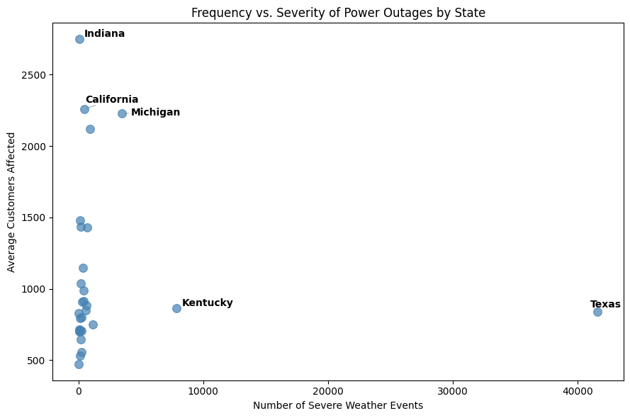
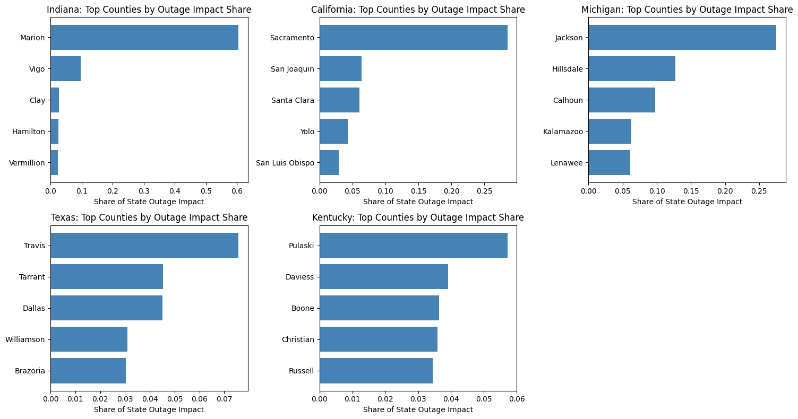

# Regional Patterns of U.S. Severe Weather Power Outages

This project explores regional patterns in severe weather–related power outages across the United States in 2023, examining how outage frequency and severity vary across states and counties.

---

## Research Questions

- Which states experience the highest frequency of severe weather outages?
- Which states experience the most severe outages?
- How is outage impact distributed within high-impact states?

---
## Key Insights

- Outage severity does not scale with event frequency.

- Outage impacts are concentrated differently across counties within each state.

 

---

## Highlights

- Analyzed ~77,000 power outage events across the United States.
- Focused on severe weather and weather or natural disaster events (>70% of all recorded outages).
- Compared outage frequency and severity at both the state and county levels.
- Identified counties contributing disproportionately to outage impacts in high-impact states.

---

## Dataset

**Event-correlated Outage Dataset in America (2023)**  
Pacific Northwest National Laboratory (PNNL)

Dataset: [Event-correlated Outage Dataset in America](https://data.openei.org/submissions/6458)

---

## Limitations

- The analysis is descriptive and does not establish causality between weather conditions and outage severity.
- Outage severity is measured using customer impact only, which does not capture duration or economic losses.
